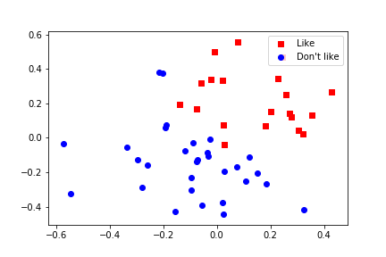

# 机器学习入门
通过一些简单的机器学习案例来学习

## 1二分类

通过数学知识来实现本程序，数学原理   

有数据 (x, y)  且分布如图

  

定义方程曲线 x*A + y*B + C = 0      (A B C为方程参数)

Z = x0*W0 + y0*W1 + B        #通过Z的取值可以判断点(x0,y0)在直线上方还是下方    
(W0 W1 B 为方程参数  通过更新参数  最终得到分类曲线)

pred = sigmoid(Z)       
预测值   sigmoid(x) = 1/(1+exp(-x))

loss = -(label*log(pred) + (1 - label)*log(1 - label))     
可以通过  loss 大小来衡量 分类的效果  

## 2线性回归
