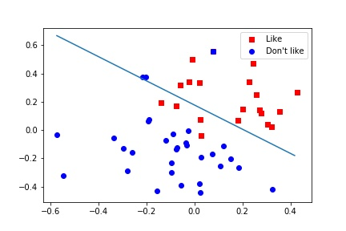

# 机器学习入门
通过一些简单的机器学习案例来学习

## 1二分类

通过数学知识来实现本程序，数学原理   

有数据 (x, y)  且分布如图

  

定义方程曲线 A * x + B * y + C = 0      (A B C为方程参数)

Z0 = x0 * W0 + y0 * W1 + B        #通过Z的取值可以判断点(x0,y0)在直线上方还是下方    
(W0 W1 B 为方程参数  通过更新参数  最终得到分类曲线)

pred = sigmoid(Z)       
预测值   sigmoid(x) = 1/(1+exp(-x))

loss = mean(-(label*log(pred) + (1 - label)*log(1 - pred)))     
可以通过  loss 大小来衡量 分类的效果  
我们的目的便是不断使 loss 缩小   

通过求偏导数  可以得到   dz = label - pred  (可参考  sigmoid 反向传播)   
dw0 = dz * x     w0 = w0 - dw0     
dw1 = dz * y     w1 = w1 - dw1    
db = dz          b = b - db      

最终曲线 如图

  

## 2线性回归
